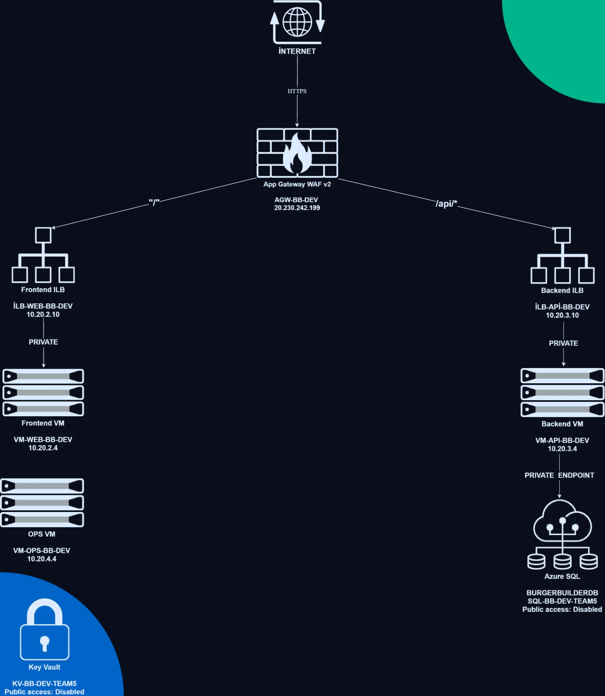

# Azure 3-Tier Architecture — Burger Builder

> A production-style Azure deployment of the Burger Builder application using private networking, Terraform, Ansible, GitHub Actions, SonarQube, and Azure monitoring.

The application is exposed publicly **only** through Azure Application Gateway WAF v2.  
All compute and data resources stay private behind the VNet.

---

## Architecture Overview

```text
Internet (HTTPS)
       |
       v
Application Gateway WAF v2
  Public IP: 20.230.242.199
       |
       +----------------------------+
       |                            |
       v                            v
ilb-web-bb-dev                ilb-api-bb-dev
10.20.2.10                    10.20.3.10
       |                            |
       v                            v
vm-web-bb-dev                  vm-api-bb-dev
10.20.2.4                      10.20.3.4
Nginx + React                  Java Spring Boot
                                    |
                                    v
                            Azure SQL Database
                            Private Endpoint only

vm-ops-bb-dev
10.20.4.4
Self-hosted runner + SonarQube + Ansible control node

Key Vault
Private Endpoint only

NAT Gateway
Outbound internet for private subnets without public VM IPs
```



---

## Technology Stack

| Layer | Technology |
|---|---|
| Infrastructure as Code | Terraform |
| Configuration Management | Ansible |
| CI/CD | GitHub Actions |
| Frontend | React + TypeScript + Vite |
| Backend | Java 21 + Maven + Spring Boot |
| Database | Azure SQL |
| Secret Management | Azure Key Vault |
| Code Quality | SonarQube |
| Monitoring | Azure Monitor + Application Insights + Log Analytics |
| Security | Application Gateway WAF v2 + NSGs + Private Endpoints |

---

## Prerequisites

Before provisioning or operating this project, make sure the following are available.

### Local tools

- Azure CLI
- Terraform `>= 1.7`
- Git
- Optional for local app work:
  - Node.js `20`
  - Java `21`
  - Maven

### Azure permissions

At minimum, the operator should be able to create and manage:

- Resource Groups
- Virtual Networks, Subnets, NSGs
- Public IPs, NAT Gateway, Load Balancers, Application Gateway
- Virtual Machines and Managed Identities
- Azure SQL Server / Database / Private Endpoints
- Key Vault
- Log Analytics / Application Insights / Alerts
- Role assignments if Key Vault RBAC is used

### GitHub permissions

- Collaborator access to the repository
- Permission to manage:
  - Actions secrets
  - Actions variables
  - Self-hosted runners

### Budget / quota notes

This project creates several paid Azure resources:

- Application Gateway WAF v2
- 3 Linux VMs
- NAT Gateway
- Azure SQL
- Log Analytics / Application Insights

Use a dedicated student/demo subscription and remember to delete or stop resources after grading if cost matters.

---

## Repository Structure

```text
devops-project2-ih/
├── .github/workflows/              # CI/CD workflows
├── backend/                        # Spring Boot backend
├── config/ansible/                 # Ansible inventory, roles, playbooks
├── docs/                           # Demo, runbook, screenshots, architecture
├── frontend/                       # React + Vite frontend
├── infra/terraform/                # Terraform bootstrap, modules, envs
└── environment.env.example
```

---

## Provisioning the Infrastructure (Terraform)

Terraform code lives under:

- `infra/terraform/bootstrap`
- `infra/terraform/envs/dev`
- `infra/terraform/modules`

### 1. Bootstrap remote state

Run once to create the storage resources for Terraform remote state.

```bash
cd infra/terraform/bootstrap
terraform init
terraform apply
```

### 2. Provision the main environment

```bash
cd infra/terraform/envs/dev
terraform init
terraform plan
terraform apply
```

### What Terraform provisions

- Virtual Network with dedicated subnets:
  - `snet-agw`
  - `snet-web`
  - `snet-api`
  - `snet-ops`
  - `snet-private-endpoints`
- Application Gateway WAF v2
- Internal Load Balancers for web and API tiers
- NAT Gateway for outbound internet from private subnets
- 3 private Linux VMs:
  - `vm-web-bb-dev`
  - `vm-api-bb-dev`
  - `vm-ops-bb-dev`
- Azure SQL + Private Endpoint
- Key Vault + Private Endpoint
- Private DNS integration
- Monitoring resources and alerts

### Idempotency expectation

After a successful apply, this should show no drift:

```bash
terraform plan
```

---

## Configuring the Servers (Ansible)

Ansible lives under:

`config/ansible/`

### Key playbooks

- `playbooks/deploy-frontend.yml`
- `playbooks/deploy-backend.yml`
- `playbooks/deploy-sonarqube.yml`
- `playbooks/ping.yml`

### Inventory

Primary inventory:

`config/ansible/inventories/dev/hosts.yml`

### What Ansible configures

- Frontend VM
  - installs Nginx
  - deploys built Vite files
- Backend VM
  - installs Java 21
  - deploys Spring Boot JAR
  - reads SQL secrets from Key Vault
  - configures systemd service
  - downloads Azure Monitor Java agent
- Ops VM
  - acts as Ansible control node
  - hosts SonarQube
  - hosts the GitHub self-hosted runner

### Example manual runs

#### Frontend

```bash
cd config/ansible
ansible-playbook playbooks/deploy-frontend.yml \
  -i inventories/dev/hosts.yml \
  --extra-vars "artifact_path=/absolute/path/to/frontend/dist"
```

#### Backend

```bash
cd config/ansible
ansible-playbook playbooks/deploy-backend.yml \
  -i inventories/dev/hosts.yml \
  --extra-vars "artifact_path=/absolute/path/to/backend/target"
```

#### SonarQube

```bash
cd config/ansible
ansible-playbook playbooks/deploy-sonarqube.yml \
  -i inventories/dev/hosts.yml
```

### Idempotency expectation

The playbooks are designed to be rerunnable:

- frontend/backend redeploys should succeed repeatedly
- backend DB initialization only runs on first setup
- later runs skip schema/data creation if already present

---

## Deployment and CI/CD (GitHub Actions)

Workflows live under:

`.github/workflows/`

### `infra.yml`

Purpose:

- `terraform fmt`
- `terraform init`
- `terraform validate`
- `terraform plan`
- `terraform apply`

### `frontend.yml`

Purpose:

- build React/Vite frontend
- run tests
- upload artifact
- deploy privately through Ansible on the self-hosted runner

### `backend.yml`

Purpose:

- build backend JAR
- run tests
- run SonarQube scan
- upload artifact
- deploy privately through Ansible on the self-hosted runner

### Runner model

- GitHub-hosted runners:
  - public build/test jobs
- Self-hosted runner on `vm-ops-bb-dev`:
  - private deploy jobs
  - SonarQube access

This is required because GitHub-hosted runners cannot directly reach private VMs and private-only services in the VNet.

---

## Required GitHub Secrets / Variables

These may be stored as repository secrets or variables depending on workflow usage.

### Azure

- `AZURE_CREDENTIALS`
- `AZURE_CLIENT_ID`
- `AZURE_CLIENT_SECRET`
- `AZURE_TENANT_ID`
- `AZURE_SUBSCRIPTION_ID`
- `SQL_PASSWORD`

### Monitoring / SonarQube

- `VITE_APPINSIGHTS_CONNECTION_STRING`
- `SONAR_TOKEN`
- `SONAR_HOST_URL`

### Optional / workflow-specific

- `FRONTEND_VM_IP`
- any approval toggles or deploy flags such as:
  - `ENABLE_PRIVATE_DEPLOY`
  - `ENABLE_SONAR`

---

## Validation

Use the following checks to prove the system works end to end.

### Public URLs

Frontend:

```bash
curl -k https://20.230.242.199/
```

Backend health:

```bash
curl -k https://20.230.242.199/api/health
```

Backend sample data:

```bash
curl -k https://20.230.242.199/api/ingredients
```

### Internal backend health check

From the API VM:

```bash
curl http://localhost:8080/actuator/health
```

### Security checks

Expected results:

| Check | Expected Result |
|---|---|
| Frontend VM public IP | None |
| Backend VM public IP | None |
| Ops VM public IP | None |
| SQL public network access | Disabled |
| Key Vault public network access | Disabled |
| App Gateway WAF | Enabled |
| SQL resolution | private endpoint / private DNS only |

### End-to-end functional proof

- Open the frontend through App Gateway
- create an order from the app
- verify the backend writes and reads from Azure SQL

### Notes about HTTPS warning

HTTPS is enabled on Application Gateway, but the browser warning appears because the project currently uses a **self-signed certificate** for demonstration.  
Traffic is encrypted, but a production deployment would use:

- a real domain name
- a CA-signed trusted certificate

---

## Monitoring and Logging

### Resources

| Resource | Purpose |
|---|---|
| Application Insights (frontend) | frontend telemetry |
| Application Insights (backend) | backend telemetry |
| Log Analytics | platform logs and diagnostics |
| Azure Monitor Alerts | operational alerting |

### Alert coverage

At least these alerts are configured:

- App Gateway backend health below expected threshold
- VM CPU above threshold
- SQL utilization above threshold

Email notifications are sent through the configured action group.

### Example Kusto queries

#### Requests in the last hour

```kusto
requests
| where timestamp > ago(1h)
| summarize count() by resultCode
| render piechart
```

#### Slow API endpoints

```kusto
requests
| where name startswith "/api"
| summarize avg(duration) by name
| order by avg_duration desc
| top 10
```

#### Exceptions in the last 24 hours

```kusto
exceptions
| where timestamp > ago(24h)
| summarize count() by type, outerMessage
| order by count_ desc
```

---

## Known Design Notes

- The web and API tiers sit behind **internal load balancers**
- This keeps the design ready for future VMSS scale-out, even though the current project uses one VM per tier
- HTTPS is enabled through Application Gateway, but the current demo certificate is self-signed

---

## Additional Documentation

| Document | Purpose |
|---|---|
| [Runbook](docs/runbook.md) | operations and troubleshooting |
| [Demo Script](docs/demo-script.md) | presentation walkthrough |
| [Presentation Plan](docs/presentation_plan.md) | slide structure and speaking plan |
| [Architecture Diagram](docs/architecture-diagram.png) | visual architecture |
| [Screenshots](docs/screenshots/) | proof for submission/demo |

